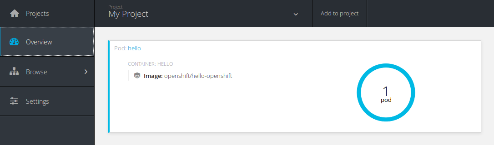
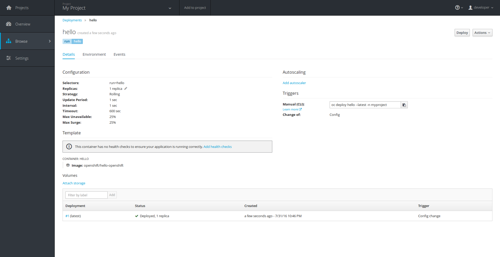
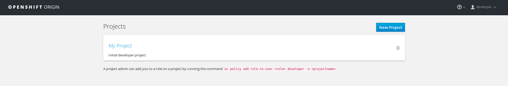
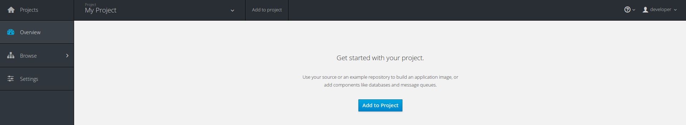
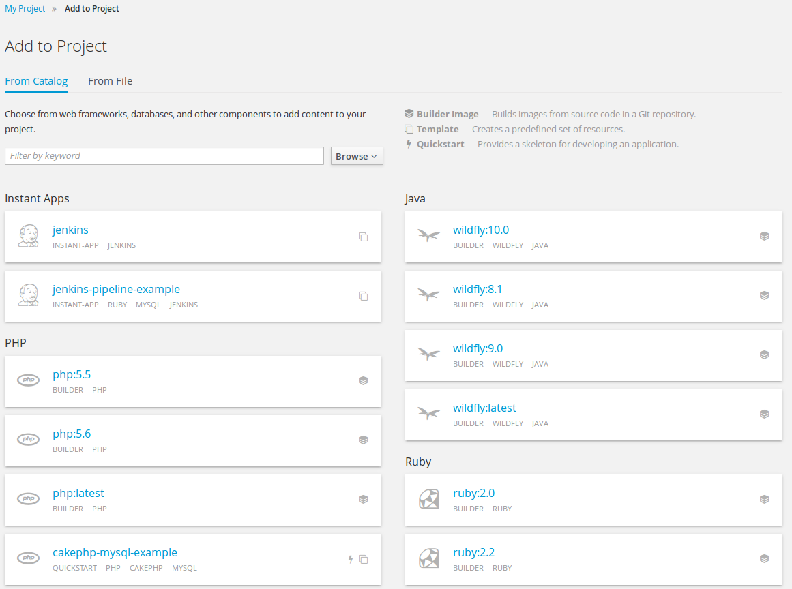
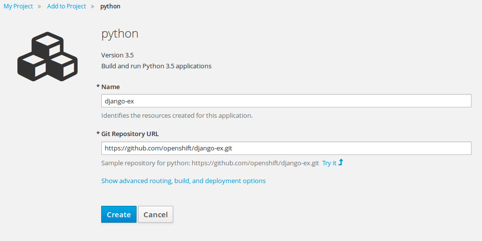
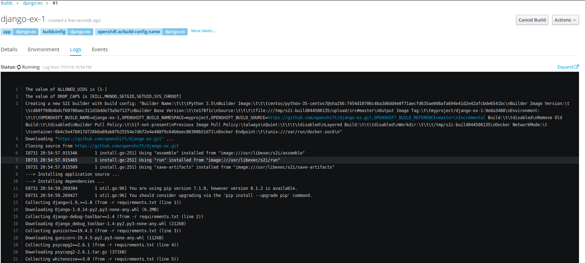
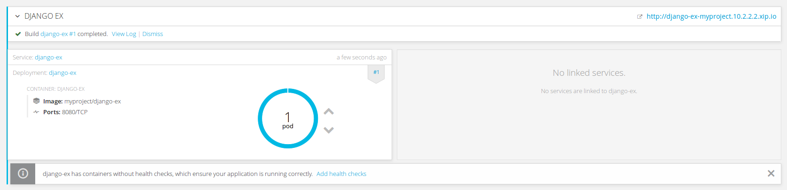

# Install OpenShift CLI

The simplest and easiest way to get OpenShift Origin binaries, is to visit our
GitHub release page at https://github.com/openshift/origin/releases/.


# Vagrant box

The included vagrant box already contains all the necessary elements to run
all-in-one container, this includes:

- oc binaries (from current master) with completions
- docker images
- go development tools
- all the necessary configuration

Interested users are encouraged to check `vagrant/` directory in this repository.


# Setting up vagrant box

To spin up the vagrant machine, import the provided `openshift3-origin.box`, or build
one yourself using `vagrant/release/release.sh` script:

```
$ vagrant box add --name openshift3-origin openshift3-origin.box
$ vagrant init openshift3-origin
$ vagrant up
```

At this point you should have the vagrant box running, and you can log into it using:

```
$ vagrant ssh
```


# Setting up cluster

With the upcoming OpenShift Origin v1.3 we're introducing `oc cluster up/down`
command, which allows one to easily setup the all-in-one container on a Docker host.

```
$ oc cluster up --public-hostname=10.2.2.2
-- Checking OpenShift client ... OK
-- Checking Docker client ... OK
...
-- Creating initial project "myproject" ... OK
-- Server Information ...
   OpenShift server started.
   The server is accessible via web console at:
       https://10.2.2.2:8443

   You are logged in as:
       User:     developer
       Password: developer

   To login as administrator:
       oc login -u system:admin
```

*NOTE: The accompanying vagrant box is configured with `10.2.2.2` IP address. To make
the web console accessible from the host we need to specify the `--public-hostname`
flag, which tells the web console how to reach the cluster.*

To verify the currently logged in user from the CLI:

```
$ oc whoami
developer
```

To login to the web console visit https://10.2.2.2:8443/ and use the credentials
presented when spinning up the cluster.

*NOTE: During spinning up the cluster new self-signed certificates are generated.
Thus, you might expect a warning from your browser about the web console using
insecure connection.*


### Troubleshooting

`oc cluster up` command is trying to be very self-explanatory in suggesting
what went wrong, the only problem you may encounter when setting up the cluster
on your local machines is, but the provided box has this already handled for you.

```
Error: did not detect an --insecure-registry argument on the Docker daemon
   Solution:

     Ensure that the Docker daemon is running with the following argument:
        --insecure-registry 172.30.0.0/16
```


# OpenShift

You can access your cluster either using the downloaded CLI, or through the web
console. The CLI commands are usually in the following form:

```
oc <verb> <resource>
```

Where verb can be get, edit, delete, set, describe, etc. Resource is the
object name you're trying to act upon, these will be `Pods`, `BuildConfigs`,
`DeploymentConfigs`, `Routes`, `Services`, `Jobs`, etc.

*NOTE: If the `oc` binary is not available on your workstation, you can alternatively
substitute it with `openshift cli`.*


# Projects

Projects are a top level concept to help you organize your applications. Upon
cluster start a default `myproject` was created for you. To get the list of all
the projects you currently have access to, run:

```
oc get projects
```

Creating a new project is done with:

```
oc new-project <project name>
```


# Running a pod

The smallest deployable unit in OpenShift is a Pod. A Pod is a group of one, or
more Docker containers deployed together and guaranteed to be on the same host.
This means that although during our workshop we'll use only single container per
Pod you can have more than one. A good example for multiple container Pod is
a log analyzer, or a monitoring container that should have direct access to the
main container.

All the resources in OpenShift are created using json or yaml definitions like
this one:

```yaml
apiVersion: v1
kind: Pod
metadata:
  name: hello
spec:
  containers:
  - name: hello
    image: openshift/hello-openshift
```

Managing these definitions is challenging, sometimes. Especially for starters,
or occasional users, and generally not much user friendly. To address this concerns,
we've created a set of handy commands that should help you to get up to speed quickly,
and easily. Having said that, let's create our first Pod:

```
$ oc run hello --image=openshift/hello-openshift --restart=Never
pod "hello" created
```

This creates a `hello` Pod running `openshift/hello-openshift` image. This image
serves a simple web server on port 8080, which displays Hello Openshift. The `--restart`
flag at the end tells the CLI to create a Pod, if omitted it'll create a DeploymentConfig
instead, which we'll do in a minute. Before doing that, let's examine the created
resource:

```
$ oc get pods
NAME      READY     STATUS    RESTARTS   AGE
hello     1/1       Running   0          2s
```

To view the overall status of the current project, iow. what resources are available:

```
$ oc status
In project My Project (myproject) on server https://10.2.2.2:8443

pod/hello runs openshift/hello-openshift

You have no services, deployment configs, or build configs.
Run 'oc new-app' to create an application.
```

or

```
$ oc get all
NAME      READY     STATUS    RESTARTS   AGE
hello     1/1       Running   0          9m
```

It's important to note that OpenShift v3 uses a declarative model where resources
(here a Pod) bring themselves in line with a predefined state. At any point in
time we can update the desired state of our resource either by uploading an updated
definition of the resource to the server, or directly editing it:

```
$ oc edit pod/hello
```

We can then verify if the changes we've introduced are applied by looking at
the Pod definition (json or yaml):

```
$ oc get pod/hello -o yaml
```

Alternatively, there's a human friendly, detailed output of any resource:

```
$ oc describe pod/hello
```

As mentioned in the beginning, all the operations we've done so far can be
achieved from the web console, as well:




### Troubleshooting

At any point in time you can remove *all* the resources in the project:

```
$ oc delete all --all
```


# Running a Deployment

Previously, we've used `oc run` to create a Pod, but it was mentioned that the
same command can be used to create a DeploymentConfig:

```
$ oc run hello --image=openshift/hello-openshift
deploymentconfig "hello" created
```

To verify current state of the project:

```
$ oc status
In project My Project (myproject) on server https://10.2.2.2:8443

dc/hello deploys docker.io/openshift/hello-openshift:latest
  deployment #1 deployed 11 seconds ago - 1 pod

1 warning identified, use 'oc status -v' to see details.
```

The `oc status` command additionally verifies correctness of the resources in our
project. Here, we see there's one warning to view it let's run the suggested command:

```
$ oc status -v
In project My Project (myproject) on server https://10.2.2.2:8443

dc/hello deploys docker.io/openshift/hello-openshift:latest
  deployment #1 deployed 14 seconds ago - 1 pod

Warnings:
  * dc/hello has no readiness probe to verify pods are ready to accept traffic or ensure deployment is successful.
    try: oc set probe dc/hello --readiness ...

View details with 'oc describe <resource>/<name>' or list everything with 'oc get all'.
```

Each DeploymentConfig should have (but it's not required) a set of user-defined
health checks, which tell the cluster how to verify if the created deployment is
working correctly. There are three possible handlers for verification:

- execute a specified command inside the container expecting success (exit code 0)
- perform a tcp check against the container's IP address on a specified port expecting
  the port is open
- perform an HTTP Get against the container's IP address on a specified port and path
  expecting successful response (http code greater than or equal to 200 and less than 400)

using which, one can perform both liveness and readiness probes.

```
oc set probe dc/hello --readiness --get-url=http://:8080/
```

After setting the readiness probe we can verify if it was properly applied to our
DeploymentConfig:

```
oc describe dc/hello
```

Now, that our application is properly defined the remaining part is to actually
expose it to outside consumers to use it. To do so we need to run twice `oc expose`
command. First we need to expose the deployment internally:

```
$ oc expose dc/hello --port 8080
service "hello" exposed
```

Now that the service, which allows accessing the pod inside the cluster needs
further exposure, iow. we need to create a route which will make our application
accessible from the outside world:

```
$ oc expose service/hello
route "hello" exposed
```

Now we should be able to access our application from outside, let's first check
what's the URL for our application:

```
$ oc get route/hello
NAME      HOST/PORT                         PATH      SERVICE      TERMINATION   LABELS
hello     hello-myproject.10.2.2.2.xip.io             hello:8080                 run=hello
```

We should be able to curl application:

```
$ curl hello-myproject.10.2.2.2.xip.io
```

Deployment overview from the web console:




# Building your application (from CLI)

OpenShift Origin allows three different types of builds:

- Source-to-image (S2I) - builds reproducible Docker images from source code. S2I
  produces ready-to-run images by injecting source code into a Docker container
  (the builder image) and letting the container prepare that source code for execution.
- Docker - builds Docker images from user provided Dockerfiles.
- Custom - allows users to define the builder image which can produce all sorts
  of artifacts. This is heavily used by OSBS team when building rpm packages.

During spinning up the cluster you might have noticed there was a log informing:

```
-- Installing registry ... OK
-- Importing image streams ... OK
```

The all-in-one cluster has a pre-installed docker registry you'll be using when
building your applications, pushing to external registries is available, as well.
Additionally, a set of pre-defined ImageStreams was also installed:

```
$ oc get imagestream -n openshift
NAME         DOCKER REPO                                TAGS                         UPDATED
jenkins      172.30.243.152:5000/openshift/jenkins      1,latest                     7 minutes ago
mariadb      172.30.243.152:5000/openshift/mariadb      10.1,latest                  7 minutes ago
mongodb      172.30.243.152:5000/openshift/mongodb      2.4,2.6,3.2 + 1 more...      7 minutes ago
mysql        172.30.243.152:5000/openshift/mysql        5.5,5.6,latest               7 minutes ago
nodejs       172.30.243.152:5000/openshift/nodejs       0.10,4,latest                8 minutes ago
perl         172.30.243.152:5000/openshift/perl         5.16,5.20,latest             8 minutes ago
php          172.30.243.152:5000/openshift/php          5.5,5.6,latest               8 minutes ago
postgresql   172.30.243.152:5000/openshift/postgresql   9.4,9.5,latest + 1 more...   7 minutes ago
python       172.30.243.152:5000/openshift/python       2.7,3.3,3.4 + 2 more...      8 minutes ago
ruby         172.30.243.152:5000/openshift/ruby         2.2,2.3,latest + 1 more...   8 minutes ago
wildfly      172.30.243.152:5000/openshift/wildfly      10.0,8.1,9.0 + 1 more...     7 minutes ago
```

Most of them are the aforementioned S2I builder images, the remaining are database
and CI images.

Now, assume we have a Python/Ruby/NodeJS/PHP/Perl application available on github:

- https://github.com/openshift/django-ex for Python
- https://github.com/openshift/rails-ex for Ruby
- https://github.com/openshift/nodejs-ex for NodeJS
- https://github.com/openshift/cakephp-ex for PHP
- https://github.com/openshift/dancer-ex for Perl

*NOTE: The vagrant box has pre-pulled latest available builder images, try to use
those when invoking build to save time on pulling other images.*

It was already mentioned before, that we've created a set of helpful commands to
simplify creating resources inside the cluster. This time, we'll be using `oc new-app`
which is responsible for creating your application from the provided arguments.
The possible input arguments include source code repository, templates and/or images.

Let's create a new python application:

```
$ oc new-app python:3.5~https://github.com/openshift/django-ex
--> Found image 6995879 (4 days old) in image stream "python" in project "openshift" under tag "3.5" for "python:3.5"

    Python 3.5
    ----------
    Platform for building and running Python 3.5 applications

    Tags: builder, python, python35, rh-python35

    * A source build using source code from https://github.com/openshift/django-ex will be created
      * The resulting image will be pushed to image stream "django-ex:latest"
      * Use 'start-build' to trigger a new build
    * This image will be deployed in deployment config "django-ex"
    * Port 8080/tcp will be load balanced by service "django-ex"
      * Other containers can access this service through the hostname "django-ex"

--> Creating resources with label app=django-ex ...
    imagestream "django-ex" created
    buildconfig "django-ex" created
    deploymentconfig "django-ex" created
    service "django-ex" created
--> Success
    Build scheduled, use 'oc logs -f bc/django-ex' to track its progress.
    Run 'oc status' to view your app.
```

As you see the command created a handful of resources, including:

- BuildConfig, which is describing the build process of our application.
- ImageStream, which defines the output docker registry for our newly built image.
- DeploymentConfig, which is describing the deployment of our application.
- Service, which is responsible for exposing our application.

The last remaining element will be creating a Route, similarly to how we've done
that last time:

```
$ oc expose service/django-ex
route "django-ex" exposed
```

Our application is being build, in the mean time let's check the current status:

```
$ oc status
In project My Project (myproject) on server https://10.2.2.2:8443

svc/django-ex - 172.30.109.61:8080
  dc/django-ex deploys istag/django-ex:latest <-
    bc/django-ex source builds https://github.com/openshift/django-ex on openshift/python:3.5
      build #1 running for less than a second
    deployment #1 waiting on image or update

1 warning identified, use 'oc status -v' to see details.
```

You've probably noticed the same warning about missing readiness check, which we
need to specify manually, again:

```
oc set probe dc/django-ex --readiness --get-url=http://:8080/
```

Let's check how does the build progress is going:

```
$ oc get build
NAME          TYPE      FROM          STATUS     STARTED         DURATION
django-ex-1   Source    Git@fa3c4f3   Complete   4 minutes ago   1m34s
```

With the build name in mind we can examine the build logs:

```
$ oc logs build/django-ex-1
...
Downloading "https://github.com/openshift/django-ex" ...
Cloning source from https://github.com/openshift/django-ex
---> Installing application source ...
---> Installing dependencies ...
...
Pushing image 172.30.243.152:5000/myproject/django-ex:latest ...
...
Push successful
```

When the build is done our application should be currently by now (or is being
deployed at the moment).

```
oc get deploy
```


# Building your application from web UI:

As mentioned several time already, we are able to go through the same process
using the web console. Here are the steps to do so:

List of available projects, that is displayed after logging in into the web console:



Upon picking the project we should see project overview page, since we don't have
any resources created it'll present us with a welcoming "Add to project" button.



We'll use that to create our first OpenShift application. Doing so, will direct us
to a page where we pick the language of the application we can deploy.



We've picked python:latest image and now it asks us about the name of the application
and the source code URL, you can either use one of the "Try it" examples I've pointed
you before or provide the source of your own application. I'm again going with
python application:



From this point you can play around and see the resources created during the application
bootstrap. One of the interesting things is definitely build logs:



Finally, when our application was successfully built we should have a nice overview
of the newly deployed application of ours:




# Running jobs

OpenShift is not only meant to run long-running applications, currently it also
allows running any kind of short-lived tasks, so called Jobs. The main difference
between the two is that Job is meant to finish within specified amount of completions.
By default this is one, so it parallelism, which allows to run the same task multiple
times.

```
$ oc run job --image=centos/python-35-centos7 --generator=job/v1 --restart=Never -- python -c "import sys; sys.exit(0)"
```

We can verify the current job status:

```
$ oc describe job/job
```

or see the logs from the Pods running the Job with:

```
$ oc get pods -l job-name=job
NAME        READY     STATUS      RESTARTS   AGE
job-92ep4   0/1       Completed   0          1m

$ oc logs pod/job-92ep4
```


# Debugging applications

You've already saw the `oc logs` command we've used to view Build logs, but this
command can be easily used to access any Pod logs. Generally, all the debugging
commands you'll see in this section are run against a single Pod, because of Pod
being the smallest deployable unit in Origin. Having said that here's a bunch of
useful commands (others can be easily "guessed" from the auto-completion).

Get a list of pods:

```
$ oc get pods
```

View the logs:

```
$ oc logs pod/<name>
```

Execute command in a pod:

```
$ oc exec <name> -- <command>
```

Connect to a pod:

```
$ oc rsh <name>
```

*NOTE: If a Pod is build of multiple containers, there's a `-c` argument to specify
which container in a Pod to connect to.*

The last command (`oc rsh`) is smart enough to actually work with other resources
than just Pods. It works with Deployments, Replication Controllers, Jobs, etc.
It works in such a way that it looks for the *first* running Pod and connects to it.

*NOTE: You can get a full list of supported commands running `oc help`.*


# Hacking origin

The vagrant box comes in with all the necessary tools installed to compile OpenShift
Origin. Actually the version you were using throughout the entire workshop was
compiled from a recent master. All is required is 6GB of memory (unfortunately since
last kubernetes rebase), so you need to reboot your machine and update the memory
requirement or add following code in your `Vagrantfile` and `vagrant reload` it.

```
    config.vm.provider "virtualbox" do |vb|
        # more memory is needed for compilation, since recent k8s rebase
        vb.memory = 6144
    end
```

After that is handled go to `$HOME/go/src/github.com/openshift/origin/` and while
in there just invoke `make` to rebuild the binary. The pre-compiled binaries were
copied to `$HOME/bin` directory, so make sure to remove those to pick up the newest
compiled ones instead.


# Links

- https://www.openshift.com/devpreview/
- https://www.openshift.org/vm/
- https://github.com/openshift/origin/
- https://github.com/openshift/source-to-image/
- https://docs.openshift.org/latest/welcome/index.html
- https://github.com/sclorg/s2i-nodejs-container
- https://github.com/sclorg/s2i-perl-container
- https://github.com/sclorg/s2i-php-container
- https://github.com/sclorg/s2i-python-container
- https://github.com/sclorg/s2i-ruby-container
- https://blog.openshift.com/source-image-s2i-deep-dive-ben-parees-openshift-commons-briefing-43/
- https://blog.openshift.com/create-s2i-builder-image/
