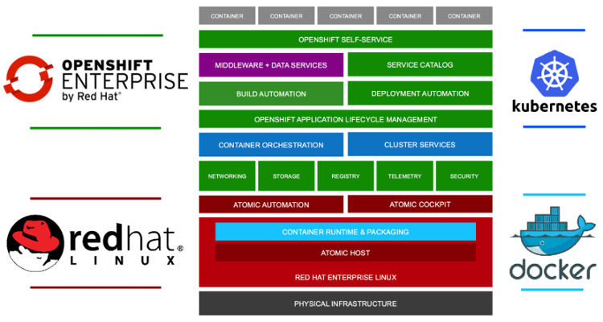

name: title
layout: true
class: center, middle, inverse
---
# Getting the Jobs Done With
# Kubernetes / OpenShift
.footnote[Maciej Szulik, KubeCon 2016]


---
layout: false
.center[
<br />
## soltysh @ .awesome[.fa-twitter[] .fa-github[] .fa-google[] .fa-bitbucket[]]
### [maszulik@redhat.com]()
### https://github.com/soltysh/talks/
<br />
<br />

]


---
<br />
<br />



---
name: title
layout: true
class: center, middle, inverse
---
# Job

???
kubectl run hello --image=python:3.5.1 --restart=Never -- python -c 'print("Hello world!")'


---
layout: false
.left-column[
## Job
]
.right-column[
```yaml
apiVersion: batch/v1
kind: Job
metadata:
  name: hello
spec:
  template:
    metadata:
      name: hello
    spec:
      containers:
      - name: hello
        image: python:3.5.1
        command: ["python", "-c",
                  "print('Hello world!')"]
      restartPolicy: Never
```
]


---
.left-column[
## Job
### - api
]
.right-column[
.bold[
```yaml
-> apiVersion: batch/v1
```
]
```yaml
kind: Job
metadata:
  name: job
spec:
  template:
    metadata:
      name: job
    spec:
      containers:
      - name: job
        image: python:3.5.1
        command: ["python", "-c",
                  "print('Hello world!')"]
      restartPolicy: Never
```
]


---
.left-column[
## Job
### - api
### - command
]
.right-column[
```yaml
apiVersion: batch/v1
kind: Job
metadata:
  name: job
spec:
  template:
    metadata:
      name: job
    spec:
      containers:
```
.bold[
```yaml
->      - name: job
          image: python:3.5.1
          command: ["python", "-c",
                    "print('Hello world!')"]
```
]
```yaml
      restartPolicy: Never
```
]


---
.left-column[
## Job
### - api
### - command
### - restart policy
]
.right-column[
```yaml
apiVersion: batch/v1
kind: Job
metadata:
  name: job
spec:
  template:
    metadata:
      name: job
    spec:
      containers:
      - name: job
        image: python:3.5.1
        command: ["python", "-c",
                  "print('Hello world!')"]
```
.bold[
```yaml
->      restartPolicy: Never
```
]]


---
.left-column[
## Job
### - api
### - command
### - restart policy
]
.right-column[
.center[
# Always
# OnFailure
# Never
]]


---
.left-column[
## Job
### - api
### - command
### - restart policy
]
.right-column[
.center[

# ~~Always~~
# OnFailure
# Never
]]

???
RestartPolicy only refers to restarts of the containers by the Kubelet on the same node.


---
.left-column[
## Job
### - api
### - command
### - restart policy
### - pod selector?
]
.right-column[
```yaml
apiVersion: batch/v1
kind: Job
metadata:
  name: job
spec:
  template:
    metadata:
      name: job
    spec:
      containers:
      - name: job
        image: python:3.5.1
        command: ["python", "-c",
                  "print('Hello world!')"]
      restartPolicy: Never
```
]

???
Pod selector is optional, if needed look in the docs how to specify your own
selector, but it's not the recommended way of doing stuff.

---
.left-column[
## Job
### - api
### - command
### - restart policy
### - pod selector?
### - parallelism / completions
]
.right-column[
### single jobs
```
.spec.completions: 1
.spec.parallelism: 1
```
]

--
.right-column[
### parallel job with a fixed completions count
```
.spec.completions: 8
.spec.parallelism: 4
```
]

--
.right-column[
### parallel job with a work queue
```
.spec.completions: <unset>
.spec.parallelism: 4
```
]


---
.left-column[
## Use Cases
]
.right-column[

# - data calculations
# - image rendering
# etc.
]


---
## Rendering
<br />
<br />
<br />


---
name: title
layout: true
class: center, middle, inverse
---
# Render demo


---
layout: false
.left-column[
## Future
]
.right-column[
## [workflow](http://releases.k8s.io/master/docs/proposals/workflow.md) by @sdminonne
## [indexed jobs](http://releases.k8s.io/master/docs/design/indexed-job.md) by @erictune
## [scheduled jobs](http://releases.k8s.io/master/docs/proposals/scheduledjob.md) by @soltysh
]


---

<br />
<br />
.center[
# http://commons.openshift.org/join
]


---
.left-column[
## Links
]
.right-column[
.center[
<br />
## soltysh @ .awesome[.fa-twitter[] .fa-github[] .fa-google[] .fa-bitbucket[]]
## [maszulik@redhat.com]()
<br />
<br />
http://releases.k8s.io/master/docs/proposals/job.md
<br />
<br />
http://releases.k8s.io/master/docs/user-guide/jobs.md
]]
