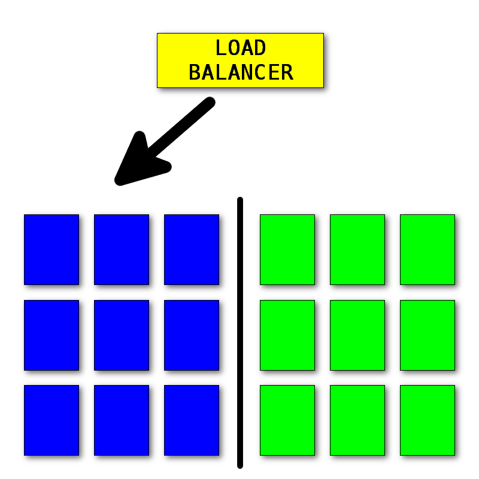
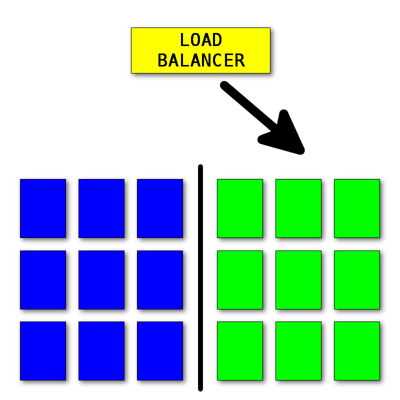
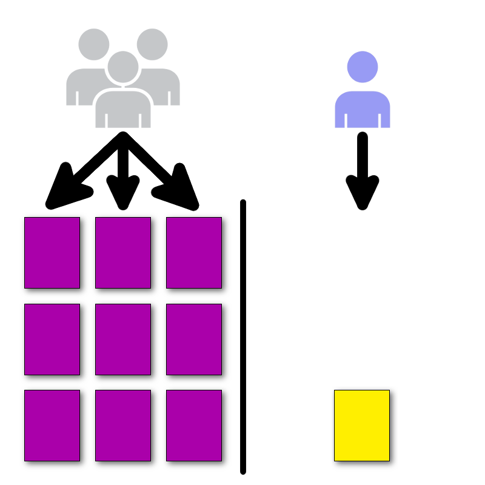
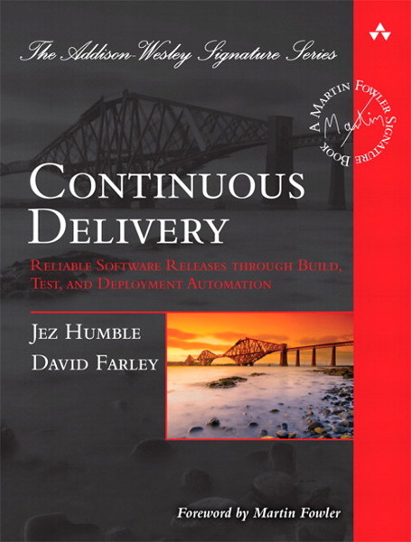

.maximage[

]

???
-

---
name: title
layout: true
class: center, middle, inverse
---
# CI / CD

???
Before we dive deep into the world of deployments we need to specify some
prerequisites without which the whole deployments automation we'll be talking
about in this presentation doesn't make sense.

---
layout: false
.left-column[
### Continuous integration
]
.right-column[
 
 
.pull-left[

]
.pull-right[
 
 

]
]

???
Continuous integration is about constantly integrating the changes from developers
during the build process (including tests), that's why this process is sometimes
referred to as continuous build.
This is one of the first crucial step for before we can move on. If your project
does not have a proper CI system in place (be that Bamboo, Jenkins, Travis, etc)
you can just stop listening at this point, because whatever I say, won't make any
sense to you.

---
.left-column[
### Continuous integration
### Continuous deployment
]
.right-column[.center[
# Delivery
# or
# Deployment
]]

???
We've covered the initial prerequisite - CI, now this is where the our party begins.
But before that, there's still one thing I'd like to clear out before we move on.

Continuous delivery or deployment? If you search the web for CI/CD acronym the
first part is obvious, it's always about the integration. With CD it's not that simple.
There are two terms used quite interchangeably, but actually both meaning two
slightly different approaches.
Continuous delivery is about producing deliverable artifacts (a package) that is ready
to be deployed. Whereas continuous deployment goes one step further iow. producing
the package and actually deploying those to test, prod, whatnot.

---
.left-column[
### Continuous integration
### Continuous deployment
]
.right-column[
.maximage[

]
]

???
As a confirmation, here's a tweet from Martin Fowler.

---
.left-column[
### Continuous deployment
#### - why
]
.right-column[
 
## Deliver more features
## Repeatability
## Minimize downtime
## Reduce the risk
]

???
Yahoo's approach to continuous deployment from Flickr.

From Jez Humble author of Continuous Delivery (http://www.informit.com/articles/article.aspx?p=1833567)

Why doing continuous deployments:
1. Low-Risk Deployments Are Incremental
Upgrading all of those in one big-bang deploy is the highest-risk way to roll out
new functionality. Instead, roll out components independently, in a side-by-side
configuration wherever possible.

2. Decouple Deployment and Release
Deployment is installation, release is making it available to users.
You can—and should—deploy your software to its production environment before you
make it available to users, so that you can perform smoke testing and any other
tasks such as waiting for caches to warm up.

3. Focus on Reducing Batch Size
Small Batch size => deploy more frequently
More frequent deploy - more stable the deployment process is.
iterate => fast changes, small changes, fast response time, easy to spot/fix bugs

If your deployment pipeline is really efficient, it can actually be quicker to
check in a patch (whether that's a change to the code or a configuration setting)
and roll forward to the new version. This is also safer than rolling back to a
previous version, because you're using the same deployment process you always use,
rather than a rollback process that's not as well tested.

4. Optimize for Resilience
System should work effectively in degraded mode.

5. Go full automation

---
name: title
layout: true
class: center, inverse
---
 
 
 
# Deployment
# strategies

---
layout: false
.left-column[
### Blue-Green
#### - requirements
]
.right-column[
 
## Twin environments
## Routing
## N-1 compatibility
]

???
Before talking about blue-green deployment let's cover the ground work.

---
.left-column[
### Blue-Green
#### - requirements
#### - process
]
.right-column[.maximage[

]]

???
Blue is the currently running version of the software that is currently serving
the traffic. Green is the new version being rolled and tested concurrently.

---
.left-column[
### Blue-Green
#### - requirements
#### - process
]
.right-column[.maximage[

]]

???
Once all the tests (either automatic, manual and whatnot) pass we can switch
the traffic to the new version.

---
name: title
layout: true
class: center, inverse
---
 
 
 
# .blue[Blue]-.green[Green]
# Demo

---
layout: false
.left-column[
### Blue-Green
#### - requirements
#### - process
#### - pros/cons
]
.right-column[
.pull-left[
.green[Pros]

### Zero downtime
### Invisible
### Tests in prod
### Easy rollback
]
.pull-right[
.red[Cons]

### Data migrations
### Lost transactions
### N-1 compatibility
]
]

???
Close to zero downtime, only the timeout needed to switch from blue to green.
Invisible to users
Tests in prod, since the two environments.
Easy rollback, just switch the load balancer back to blue.

---
.left-column[
### Canary
#### - requirements
]
.right-column[
 
## Feature toggle
## N-1 compatibility
]

???
Feature toggle used at facebook - Gatekeeper

---
.left-column[
### Canary
#### - requirements
#### - process
]
.right-column[.maximage[

]]

???
-

---
name: title
layout: true
class: center, inverse
---
 
 
 
# .canary[Canary]
# Demo

---
layout: false
.left-column[
### Canary
#### - requirements
#### - process
#### - pros/cons
]
.right-column[
.pull-left[
.green[Pros]

### Gradual verification
### Incremental roll-out
### Feature toggle
### Capacity tests
]
.pull-right[
.red[Cons]

### Data migrations
### Multiple versions
### Mobile/Desktop
### N-1 compatibility
]
]

???
-

---
.left-column[
### Rolling
#### - requirements
]
.right-column[
 
## N+1 instances
## N-1 compatibility
]

???
-

---
.left-column[
### Rolling
#### - requirements
#### - process
]
.right-column[
 
 
.maximage[

]
]

???
-

---
name: title
layout: true
class: center, inverse
---
 
 
 
# Rolling
# Demo

---
layout: false
.left-column[
### Rolling
#### - requirements
#### - process
#### - pros/cons
]
.right-column[
.pull-left[
.green[Pros]

### Incremental roll-out
### Gradual verification
]
.pull-right[
.red[Cons]

### N+1 instances
### Lost transactions
### Log-off users
]
]

???
-

---
.left-column[
### Continuous deployment
#### - why
#### - strategies
#### - takeaways
]
.right-column[
 
## No silver bullet
## Cross-team effort
]

???
None of the presented deployments strategy is a silver bullet, so use each accordingly
and with a bit of thoughtfulness.

A/B (quite frequently mistaken with Blue-Green deployments) testing is about
measuring functionality in the app (usually UI).

---
name: title
layout: true
class: center
---
 
 
 
 
 
 
.maximage[

]

---
name: title
layout: true
class: center
---
.maximage[

]
