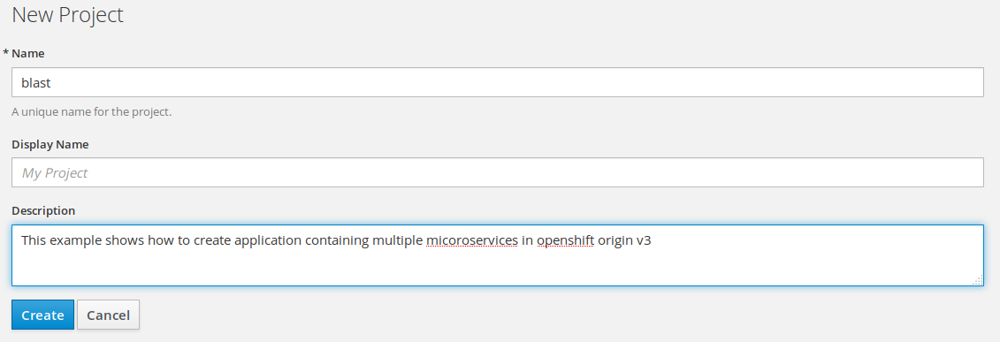
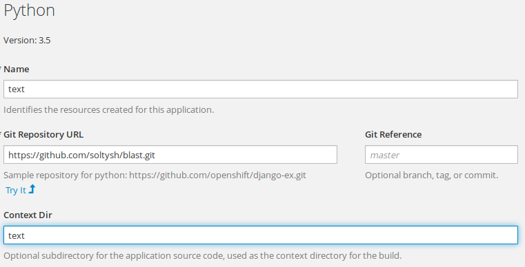
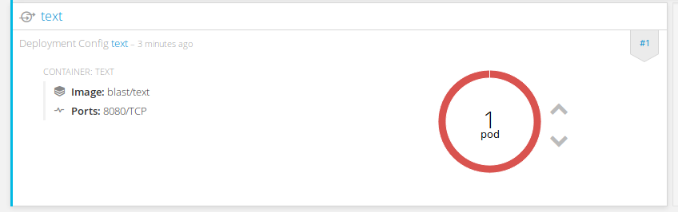
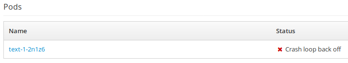
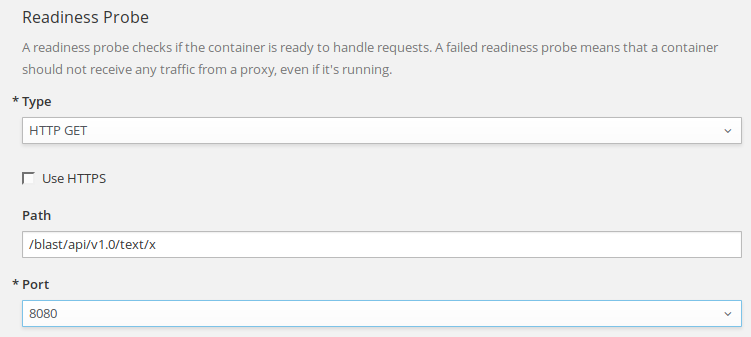

# Effectively running python applications in Kubernetes/OpenShift

## Introduction to CLI

    oc <verb> <resource>/<name>

where:
- `verb` is one of: `get`, `set`, `describe`, etc.  Run `oc help` to get a full list.
- `resource` is one of resources supported by the platform (or its alias), this includes `DeploymentConfig` (or `dc`), `BuildConfig` (`bc`), `ImageStream` (`is`), `Service` (`svc`), etc.  When bash completions are installed, running `oc get` + `<tab>` will give you a list of available resource names.
- `name` is the resource name given by the user.

Each of the commands can additionally contain flags, see `oc <verb> --help` to get the list of all supported flags.

## Project

We'll start with creating a [project](https://docs.openshift.org/latest/dev_guide/projects.html) where we'll setup the entire application.

    oc new-project blast
        --description="This example shows how to create application containing multiple micoroservices in openshift origin v3"

** Project vs Namespace **

TODO

## Frontend - UI

Create our application frontend using following command:

    oc new-app \
        soltysh/lighttpd-centos7~https://github.com/soltysh/blast.git \
        --context-dir=ui \
        --name=ui \
        --labels=app=ui

This will result in OpenShift creating the following resources for us:
- [build configuration](https://docs.openshift.org/latest/dev_guide/builds/index.html)
- [deployment configuration](https://docs.openshift.org/latest/dev_guide/deployments/how_deployments_work.html)
- [image streams](https://docs.openshift.org/latest/dev_guide/managing_images.html)
- [service](https://docs.openshift.org/latest/architecture/core_concepts/pods_and_services.html)

** Explain BuildConfig ** (explain S2I build process in details)

** Explain DeploymentConfig ** (including colorful deployments demos: https://opensource.com/article/17/5/colorful-deployments)
** Explain ReplicationController **
** Explain Pod **

** Explain ImageStreams ** (intro to image streams, including: https://blog.openshift.com/image-streams-faq/)

** Explain Service **

### Probes

After a few minutes, our application should be up and ready, but we want the platform to monitor for its [liveness and readiness](https://docs.openshift.org/latest/dev_guide/application_health.html).  Liveness - verifies the pod is healthy, iow. running, whereas readiness goes one step further and checks whether your application is ready to accept requests.  To set readiness check our newly created application we'll create a readiness probe verifying port 8080 on which the application is running:

    oc set probe dc/ui --readiness --get-url=http://:8080/

### Routes

Our final step is to expose the application to the outside world, to do that we'll
use the following command:

    oc expose svc/ui

By now we should be able to reach our application, you can see the route address
with:

    oc get route/ui

## Text backend

This time let's try using the web UI to create one of the python backends.

**NOTE:** Don't forget to click `advanced options` and set `Context Dir` to `text`.

Alternatively, you can use the CLI:

    oc new-app \
        https://github.com/soltysh/blast.git \
        --context-dir=text \
        --name=text \
        --image-stream=python:3.5 \
        --labels=app=text

Once the application builds we should be able to have the backend up and running.  Unfortunately, it looks like it's not working as expected, let's debug what's wrong with our application.  Click `#1`:

and dive into deployment details:

to check the pod logs running our application:

That's right our python runtime has a few requirements.  Let's check the python [S2I builder image](https://github.com/sclorg/s2i-python-container) in details.

** Describe S2I python builder **

To solve our problem we need to set `APP_MODULE=api:app` environment variable:

Alternatively:

    oc set env dc/text APP_MODULE=api:app

Like previously let's configure this application readiness probe, actually the web console will suggest us to do so:

    oc set probe dc/text --readiness --get-url=http://:8080/blast/api/v1.0/text/x

## ConfigMap

    oc set env dc/text --from=configmap/config

## Text database

    oc new-app mongodb:3.2 \
        --name=text-db \
        --labels=app=text \
        --env=MONGODB_ADMIN_PASSWORD=admin1234 \
              MONGODB_DATABASE=blast_text

## Templates

    oc new-app https://raw.githubusercontent.com/soltysh/blast/master/video/template.yaml
    oc new-app https://raw.githubusercontent.com/soltysh/blast/master/image/template.yaml

## CronJob

    oc run scraper --schedule="0/1 * * * *" --image=soltysh/scraper --restart=OnFailure

## ServiceAccounts

## Resource Limits
