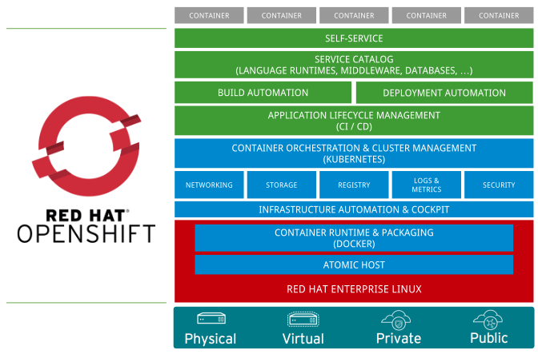
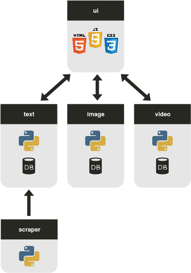

name: title
layout: true
class: center, middle, inverse
---
.center[
# Effectively running
# python applications
# in Kubernetes/OpenShift

## Maciej Szulik / @soltysh
### OpenShift / Red Hat
]

---
layout: false
.center[
## 10k view

]

---
.center[
## OpenShift = Kubernetes + Build, Deployment, Image Management

]

---
.center[
## Application architecture

]

---
.center[
## S2I build

]

