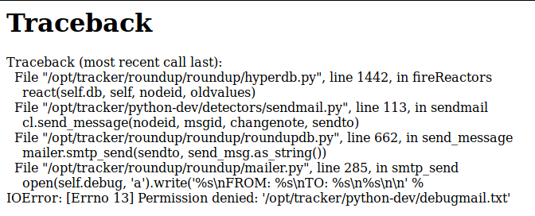

layout: true
class: center, middle
---
# The new life of bugs.python.org
<br /><br />
### Maciej Szulik / @soltysh


---
background-image: url(img/todd-quackenbush-701.jpg)

???

This presentation is covering the current work I'm doing on migrating
bugs.python.org to OpenShift. It's in no way complete, there are many
moving pieces, but let the facts speak for itself.


---
background-image: url(img/bpo.png)
.footnote[
http://roundup.sourceforge.net
]
???

bugs.python.org is a bug tracker supporting the development of the CPython, which is
the most popular implementation of Python language, and probably the one you are already using.
The system itself, is a reasonably simple web app, written in python, obviously. It is called
roundup.

Back in May last year, during PyCon US in Portland, Oregon I was approached by Brett Cannon
and Mark Mangoba with a task to migrate current BPO instance to a new home. My initial reaction
was 'Let's OpenShift Online for that', and the rest, as they say, is a history, well almost ;)

---
background-image: url(img/thomas-kvistholt-191153.jpg)

???

Upon inspecting the current deployment details I found that:

1. I need to run roundup
2. I need to run postgresql

None of this was new to me, since I've been supporting bugs.python.org for more than
2 years now. I won't bore you with the exact deployment details of the current instance
since in some time it'll be history, so let's focus on the future instead.
And so, armed with the knowledge about how bpo works, and dirty details of the current
deployment, soon to be replaced, I jumped into work.


---
# Get the app
# in a container

???

The first step was put the entire app (as is) inside a container and try running it.
But, actually that step was already handled for me by a PSF's GSoC student a few years
back. He created a docker image which would allow a local development of BPO. For that
he deserves a big round of aplause! So instead of starting from scartch I actually based
my work on top of his.


---
## docker run
## python/docker-bpo
.footnote[
https://github.com/python/docker-bpo
]

???

It also happens that we publish BPO image on our official dockerhub account, so that anyone
interested can help with BPO fixes :) In short, this image mounts a local directories with
BPO sources and launches both PostgreSQL and roundup for you. Since I've been using it since
the early days I was very familiar with the entire structure of the image.


---
# Builder image

???

All I needed was to split the all-in-one image with mountable source code, into separate
pieces. The first step was to be able to build the BPO instance from sources.


---
## Source-to-Image

.footnote[
https://github.com/openshift/source-to-image
]

???

I couldn't use any of the official builder images provided by OpenShift, because
bpo components are kept in a mercurial repository and S2I supports git, by default.
Moreover, there are two repositories:

1. the main roundup installation with some BPO specific bits,
2. where the majority of customization is placed

And that's again not supported in S2I.


---

## https://github.com/python/bpo-builder

???

I ended up building an S2I builder based on the article I wrote a while ago
(https://blog.openshift.com/create-s2i-builder-image). In short, one needs
to write:

1. Dockerfile for the image.
2. S2I scripts (assemble & run).


---
# Database

???

Initially, we were planning to use an externally hosted database, something like
Amazon RDS or similar. This significantly simplified my work, because I didn't care
about the database part at all. I've used a temporary PostgreSQL instance, one can
easily setup on OpenShift and worry about a thing.


---
#### oc cluster up

# Put it all together

#### and enjoy

???

With both of the bits figured out,I was confident that I'm ready for my full build
and deployment workflow for bugs.python.org. That was pretty bold, especially with
my current knowledge ;)


---
#### Initial build

# Finished successfully

???

While building the builder image I was also using the s2i CLI for testing if it's
working as it should. So unsurprisingly this step finished fast and without any problems.
A few observations I've had back then, was that I should probably improve the logging
information so that it's clear what is being built and from where, since from start
I allowed specifying different repository URLs through environment variables injected
into build configuration.


---
#### Initial deployment

```python
WARNING: The database is already initialised!
If you re-initialise it, you will lose all the data!
Traceback (most recent call last):
  File "/opt/tracker/bin/roundup-admin", line 15, in <module>
    run()
  File "/opt/tracker/roundup/roundup/scripts/roundup_admin.py", line 49, in run
    sys.exit(tool.main())
  File "/opt/tracker/roundup/roundup/admin.py", line 1635, in main
    ret = self.run_command(args)
  File "/opt/tracker/roundup/roundup/admin.py", line 1504, in run_command
    return self.do_initialise(self.tracker_home, args)
  File "/opt/tracker/roundup/roundup/admin.py", line 536, in do_initialise
    Erase it? Y/N: """))
EOFError: EOF when reading a line
```

???

With way too much optimism, I moved to the second part of the flow - the deployment.
While the build was kicking in, I quickly deployed the latest available PostreSQL
image and waited impatiently for the initial deplyment, which obviously failed.

The problem was with the way how roundup initiates database, if database exists
it assumes it was already initiated, but since it's empty it won't run. That's
sort of the chicken and egg problem. Eventually, I went with two deployments
one which was initiating the database and a second that was using the already
initialized database. For that I use an environment variable. So that the production
system isn't accidentally erased (sic!). This also required some manual intervention
on the PostgreSQL end: removing the database and giving higher privileges for the
roundup user.


---
#### Initial deployment cont'd

```python
Traceback (most recent call last):
  File "/opt/tracker/bin/roundup-server", line 11, in <module>
    run()
  File "/opt/tracker/roundup/roundup/scripts/roundup_server.py", line 978, in run
    httpd = config.get_server()
  File "/opt/tracker/roundup/roundup/scripts/roundup_server.py", line 633, in
    get_server for (name, home) in tracker_homes])
  File "/opt/tracker/roundup/roundup/instance.py", line 327, in open
    return Tracker(tracker_home, optimize=optimize)
  File "/opt/tracker/roundup/roundup/instance.py", line 102, in __init__
    self.detectors = self.get_extensions('detectors')
  File "/opt/tracker/roundup/roundup/instance.py", line 207, in get_extensions
    self._execfile(os.path.join(dirname, name), env)
  File "/opt/tracker/roundup/roundup/instance.py", line 239, in _execfile
    self._exec(self._compile(fname), env)
  File "/opt/tracker/roundup/roundup/instance.py", line 233, in _exec
    exec(obj, env)
  File "/opt/tracker/python-dev/detectors/autonosy.py", line 8, in <module>
    from roundup.anypy.sets_ import set
ImportError: No module named sets_
```

???

After solving the database issue I re-run the deployment as previously described,
and unfortunately I was surprised with yet another unexpected problem. Sometime
last year Ezio Melotti, who is one of the few of us actively maintaining bpo,
performed a roundup update to catch up the latest updates. It appears that during
this update parts of our customization relied on an old module which was released
in that upgrade. Since none of the places builds the application from scratch
all the places: production, Ezio's and mine workspaces were working due to previously
built pyc files. Since I've perform a clean build from a source repository this
problem was caught immediately. Shortly after syncing with Ezio I submitted a proper
fix to our main repository.

---
#### Initial deployment cont'd


???

The other problem that bit me, was the permissions. While building the builder image
I didn't properly planned the directories and fixing the access rights accordingly.
If you have a look at the current `assemble` script you'll notice a section that's
responsible just for that.


---
background-image: url(img/invalid_url.png)

???

And with all that in place I was able to enjoy my first installment of bugs.python.org
on OpenShift, well almost.


---
#### Configuration
```python
Traceback (most recent call last):
  File "/opt/tracker/bin/roundup-server", line 11, in <module>
    run()
  File "/opt/tracker/roundup/roundup/scripts/roundup_server.py", line 978, in run
    httpd = config.get_server()
  File "/opt/tracker/roundup/roundup/scripts/roundup_server.py", line 633, in
    get_server for (name, home) in tracker_homes])
  File "/opt/tracker/roundup/roundup/instance.py", line 327, in open
    return Tracker(tracker_home, optimize=optimize)
  File "/opt/tracker/roundup/roundup/instance.py", line 95, in __init__
    self.templates.precompile()
  File "/opt/tracker/roundup/roundup/cgi/templating.py", line 182, in precompile
    for filename in os.listdir(self.dir):
OSError: [Errno 2] No such file or directory: '/opt/tracker/python-dev/html'
```

???

One last thing was to split out the configuration bits, which until this point was
backed into the image. The choice was pretty simple, I had to choose between a ConfigMap
and a Secret, which would hold the necessary config files. I went with the latter and
upon my first mount attempt I was presented with yet another problem :/ The reason
for that was that I was mounting files into a directory that already had some contents,
which resulted in the entire directory contents being overridden. Thankfully getting into
container allowed me to quickly (sort of) identify the problem and address it. The remedy
was to mount these files into a separate directory and link them into the place where
roundup was normally expecting them to exist.

The configuration was the final piece to my success. I was now able to deploy a test
instance.


---
background-image: url(img/success.png)

.footnote[
http://test.bugs.python.org
]

???

Unfortunately, this story has no happy ending, well at least yet ;)
As soon as all the tears of joy dried I was faced with another problem:

---
# Database

### part 2

???

We've decided that instead of using one of the hosted solutions we'd like to run PostgreSQL
alongside, on OpenShift. You should've seen my face back then ;)


---
## Database on OpenShift

#### https://github.com/CrunchyData/crunchy-containers
#### https://github.com/zalando/patroni

???

Long story short, I reached out to a few persons that I knew can help me with that asking
for advice. Aside from the 'use a hosted version' recommendation I was pointed to two projects:

1. Crunchy Data provides enterprise PostgreSQL docker containers, including full administrative
   and monitoring tools
2. Zalando with project called Patroni, which is a template for high availability PostgreSQL,
   which can run on Kuberentes.

Unintuitively, I went with the second approach, which leads me to this day. Currently, I'm struggling
with running Patroni on my own. Whereas Josh Berkus, our own PostgreSQL master is trying to make
Patroni work on top of OpenShift. The current problem is one of the main security features of OpenShift,
specifically the random UID assigned to containers.

---
# What's
# next?

???

I'm guessing many of you are asking what's next? As soon as the Patroni problem will be solved and
we'll be able to run in on top of OpenShift I need to perform extensive tests around performance of
the overall approach, and most importantly its stability. Finally, we need proper monitoring tools
hooked up for both roundup and PostgreSQL.

---
background-image: url(img/emily-morter-188019.jpg)

.footnote[
https://unsplash.com
]
