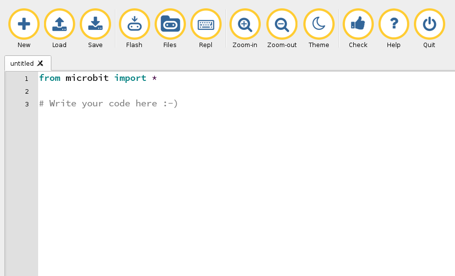

name: title
layout: true
class: center, middle, inverse
---
.center[
# Programowanie
# dla każdego
<br /><br />
## Maciej Szulik / Red Hat
]

---
layout: false
.center[
<br />
<br />
<br />
<br />

]

---
background-image: url(img/digits.png)
class: inverse
.center[
<br />
<br />
<br />
<br />
# Co to jest programowanie?
]

---
.center[
# Co to jest python?
<br />
<br />
<br />

]

---
.center[
# Co to jest micro:bit?
<br />

]

---
.center[

]

---
.left-column[
## Wyświetlacz
]
.right-column[
.big-code[
```python
display.show("Hej Nikodem!")
```
]]

---
.left-column[
## Wyświetlacz
]
.right-column[
.big-code[
```python
display.show("Hej Nikodem!")
```
```python
display.show(Image.COW)
```
]]

---
.left-column[
## Wyświetlacz
]
.right-column[
.big-code[
```python
display.show("Hej Nikodem!")
```
```python
display.show(Image.COW)
```
```python
x = Image(
"90009:"
"09090:"
"00900:"
"09090:"
"90009"
)
display.show(x)
```
]]

---
.left-column[
## Wyświetlacz
## Przyciski
]
.right-column[
.big-code[
```python
while True:
    a = button_a.was_pressed()
    b = button_b.was_pressed()
    if a and b:
        display.show(Image.ANGRY)
    elif a:
        display.show(Image.HAPPY)
    elif b:
        display.show(Image.SAD)
```
]]

---
.left-column[
## Wyświetlacz
## Przyciski
## Animacje
]
.right-column[
.big-code[
```python
while True:
    display.show(Image.ALL_CLOCKS)
```
]]

---
.left-column[
## Wyświetlacz
## Przyciski
## Animacje
]
.right-column[
.big-code[
```python
while True:
    display.show(Image.ALL_CLOCKS)
```
<br />
```python
from random import randint
...
randint(a, b)
```
]]

---
.left-column[
## Wyświetlacz
## Przyciski
## Animacje
## Akcelerometr
]
.right-column[
.big-code[
```python
while True:
    gesture =
      accelerometer.current_gesture()
    if gesture == "face up":
        display.show(Image.HAPPY)
    else:
        display.show(Image.ANGRY)
```
```
up, down, left, right,
face up, face down, shake
```
]]

---
.left-column[
## Wyświetlacz
## Przyciski
## Animacje
## Akcelerometr
## Radio
]
.right-column[
.big-code[
```python
from random import randint
import radio

radio.on()
radio.config(group=1)
while True:
    display.show(Image.ASLEEP)
    if button_a.was_pressed():
        radio.send(str(randint(1, 10)))
    incoming = radio.receive()
    if incoming:
        display.show(str(incoming))
        sleep(1000)
```
]]

---
name: title
layout: true
class: center, middle
---
# Maciej Szulik

