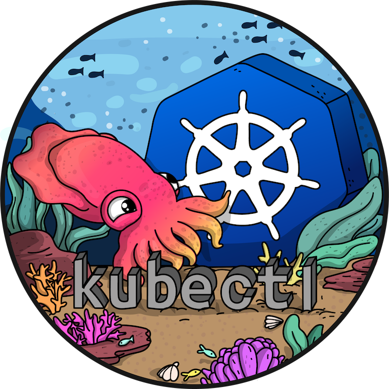

name: inverse
layout: true
class: center, middle, inverse
---

.shadow-blue[
### Everything you always wanted to know about kubectl & oc but were afraid to ask
]
.shadow-red[
### Maciej Szulik / @soltysh
### OpenShift / SIG-CLI
]

---
layout: true
class: center, middle
---
### Biweekly meetings on Wednesdays at 18:00 CET / 12:00 EDT / 09:00 PT

### [#sig-cli](https://kubernetes.slack.com/messages/C2GL57FJ4/)

### [kubernetes-sig-cli@googlegroups.com](kubernetes-sig-cli@googlegroups.com)

---

.left-column[
.image100[

 
 
 
 
 
 

]]
.right-column[
.big-text[
https://github.com/kubernetes/kubernetes
 
 
vs
 
 
https://github.com/kubernetes/kubectl
]]

---

.left-column[
.image100[

 
 
 
 
 
 

]]
.right-column[
.big-text[
https://github.com/kubernetes/kubernetes/tree/master/staging/src/k8s.io/kubectl/
 
 
vs
 
 
https://github.com/kubernetes/kubectl
]]

---
.left-column[
.image100[

]]
.right-column[
.big-text[
https://github.com/openshift/oc
]]

---
background-image: url(img/sergi-kabrera-2xU7rYxsTiM-unsplash.jpg)
#### COMPATIBILITY

.blue[
# +/- 1 versions
]

.footnote[
https://unsplash.com/photos/2xU7rYxsTiM
]

---
#### PLUGINS
.big-text[
https://github.com/kubernetes/cli-runtime
 
 
https://github.com/kubernetes/sample-cli-plugin
 
 
https://github.com/kubernetes-sigs/krew
]

---
#### FEATURES
## server-side print
## kubectl debug
## kubectl events

---
#### SUB-PROJECTS
### Krew
https://github.com/kubernetes-sigs/krew
### Kui
https://github.com/IBM/kui
### Kustomize
https://github.com/kubernetes-sigs/kustomize

---
#### FUTURE
### separate repository
### dynamic commands
### commands in headers
### plugin-like dev model

---
### Biweekly meetings on Wednesdays at 18:00 CET / 12:00 EDT / 09:00 PT

### [#sig-cli](https://kubernetes.slack.com/messages/C2GL57FJ4/)

### [kubernetes-sig-cli@googlegroups.com](kubernetes-sig-cli@googlegroups.com)

---
layout: false
class: center, inverse
background-image: url(img/jon-tyson-hhq1Lxtuwd8-unsplash.jpg)
.pull-left[
 
# @soltysh
]
.footnote[
https://unsplash.com/photos/hhq1Lxtuwd8
]
