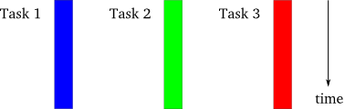

## Async I/O ##

### Maciej Szulik ###

### soltysh @ <i class="fa-twitter"></i><i class="fa-github"></i><i class="fa-bitbucket"></i> ###

Katowice, 2014

## TOC ##

* Synchronous vs Threaded vs Asynchronous
* Asynchronous I/O
* Architecture
* Examples
* Q & A

## Synchronous ##

\ 

## Threaded ##

## Asynchronous ##

## Asynchronous I/O ##

* Asynchronous frameworks:
    - Twisted
    - Tornado
    - Stackless Python
* asyncio (PEP-3156)

## Asynchronous I/O ##

* Usability
* Interoperability
* Multiplatform
* TCP & UDP support
* IPv4 & IPv6 suport
* Pipes, subprocesses, etc.
* Standard library (no 3rd party dependency)
* Almost pure python

## Architecture ##

* Coroutines, Futures, Tasks
* Event loop
* Transport & Protocols

## Coroutines et all ##

* Coroutines - just a generator function (`@coroutine`)
* Future - object with result
* Task - variant (subclass) of a coroutine

## Event loop ##

* Multiplexes different activities
* Loop:
    - `get_event_loop`
    - `set_event_loop`
    - `new_event_loop`
    - `run_forever`
    - `run_until_complete`
    - `is_running`
    - `stop`
    - `close`

## Event loop ##

* Callbacks
    - `call_soon`
    - `call_later`
    - `call_at`
* No repeated callback

## Transport & Protocol ##

* Transport -> socket, pipe
* Protocol -> your application

## Examples ##

## Summary ##

* asyncio vs threads
* python 3.4+
* https://code.google.com/p/tulip/
* https://groups.google.com/forum/?fromgroups#!forum/python-tulip
* http://www.python.org/dev/peps/pep-3156/
* http://www.youtube.com/watch?v=1coLC-MUCJc
* http://www.youtube.com/watch?v=c7D63mqCs5Y

## Questions? ##

### Maciej Szulik ###

### soltysh @ <i class="fa-twitter"></i><i class="fa-github"></i><i class="fa-bitbucket"></i> ###

